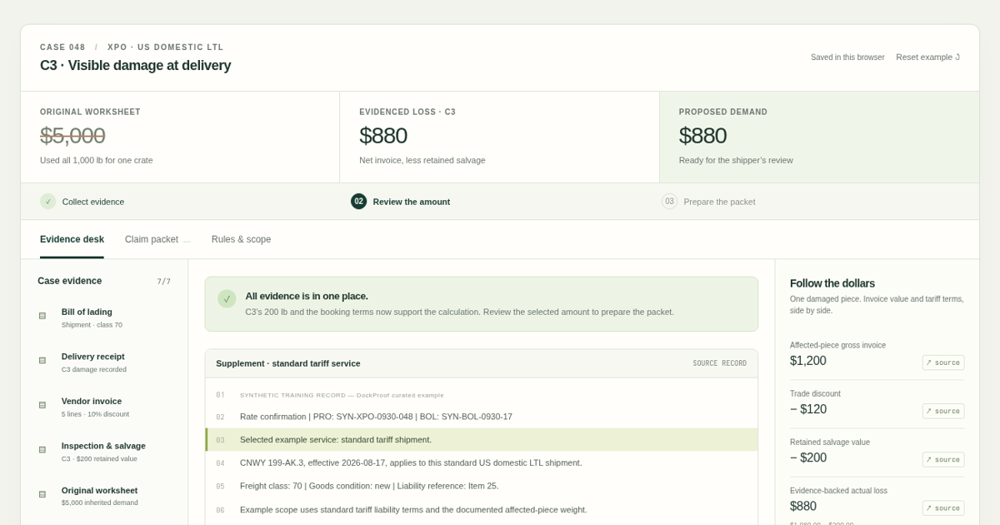

# DockProof

**Every claim dollar, traced.**

[Open the evidence desk](https://blucca.github.io/dockproof/) · [Rule sources](docs/sources.md) · [Product walkthrough](docs/product.md)

One crate arrives damaged. The bill lists five. The original worksheet asks for **$5,000** using the entire shipment's weight.

DockProof follows the evidence to a reviewed **$880** claim:

1. Inspect the invoice, delivery receipt, bill of lading, and salvage record.
2. Send precise requests for the damaged crate's weight and booking terms.
3. Add the example replies: **200 lb** for C3 and the selected carrier service.
4. Trace **$1,200 − $120 discount − $200 salvage = $880** in evidenced loss.
5. Compare the **$1,000** standard-tariff reference limit, review the amount, and export the claim packet.

Change the example to a spot quote and the reference limit becomes **$200**. The prior review clears and the packet requires a fresh decision.



## What works

- A complete interactive, browser-local example with seven original synthetic records.
- Line-linked evidence, targeted requests, and explicit received-document status.
- One shared JavaScript engine for monetary arithmetic, calendar deadlines, scope, and review snapshots.
- Separate actual loss, tariff reference limit, and shipper-selected demand.
- A 13-file ZIP: claim letter, CSV/JSON valuation, source references, original records, printable review, and document manifest.
- A printable claim and persistent workspace, with a responsive mobile layout.
- A local Nebius Token Factory adapter for NVIDIA Nemotron structured document-text extraction and exact-quote checks.

The hosted desk uses curated example facts. The live extraction adapter is an account-activation milestone; the current release's integration checks use controlled API responses. Candidate extraction and the example claim desk are separate workspaces in this revision.

## Run locally

Requires Node.js 22 or newer. The application uses native Node and browser APIs.

```sh
git clone https://github.com/blucca/dockproof.git
cd dockproof
npm start
```

Open **http://127.0.0.1:4318/**. The example works immediately.

For live document-text extraction, put your Nebius key in your local environment:

```sh
export NEBIUS_API_KEY='your-key'
export NEBIUS_MODEL='nvidia/nemotron-3-super-120b-a12b'
export NEBIUS_BASE_URL='https://api.tokenfactory.us-central1.nebius.com/v1'
npm start
```

Open **Local extraction workspace** below the evidence desk. Paste document text and select **Extract candidate facts**. The server sends the text to your Nebius account; the browser displays the candidate values and exact source quotes for review.

The endpoint also accepts multiple text documents:

```sh
curl http://127.0.0.1:4318/api/extract \
  -H 'Content-Type: application/json' \
  --data '{"documents":[{"id":"weight","name":"Warehouse weight sheet","text":"Crate C3 actual gross weight: 200 lb."}]}'
```

The request uses `response_format.json_schema` with NVIDIA Nemotron. Each candidate contains `field`, `value`, `document_id`, and `quote`; the adapter checks that the quote appears verbatim in the named input and returns its character span. Missing and conflicting facts become evidence questions. API credentials stay in the server environment. Text payloads are handled in memory.

## Rule scope

The initial example covers **XPO US interstate LTL**, new ordinary goods, one visibly damaged shipping piece, actual class 70, direct shipper terms, and a standard-tariff or spot-quote basis. The rule version is **CNWY 199-AK.3, effective August 17, 2026**.

The engine routes special commodities, used goods, broker terms, excess-value agreements, and other unsupported inputs to manual review. The filing deadline uses delivery plus nine calendar months and describes **carrier receipt**. An exported packet retains `awaiting_carrier_submission` until receipt evidence is recorded.

The public example's companies, shipment identifiers, records, and amounts are synthetic. The tariff and federal regulation links point to official sources. [Read the source mapping](docs/sources.md).

## Architecture

```text
web/data/sample-case.json     Original evidence + curated example facts
web/core/case-engine.mjs      Deterministic valuation, deadlines, review, packet
web/core/zip.mjs              Small UTF-8 ZIP writer
web/app.mjs                  Evidence desk, citations, scenarios, local workspace
src/nebius.mjs               NVIDIA structured extraction + exact citation spans
src/server.mjs               Local static server and extraction endpoint
```

```sh
npm test
```

The focused checks cover missing evidence, affected-piece weight, invoice discounts and salvage, month-end deadlines, scope, changed-evidence review invalidation, export readiness, and model response citations. The browser walkthrough also checks the downloaded archive, the spot-quote branch, persistence, and a 390 px mobile viewport.

Built by [Blucca](https://github.com/blucca) with autonomous AI development assistance. MIT-licensed application code and original synthetic records.
