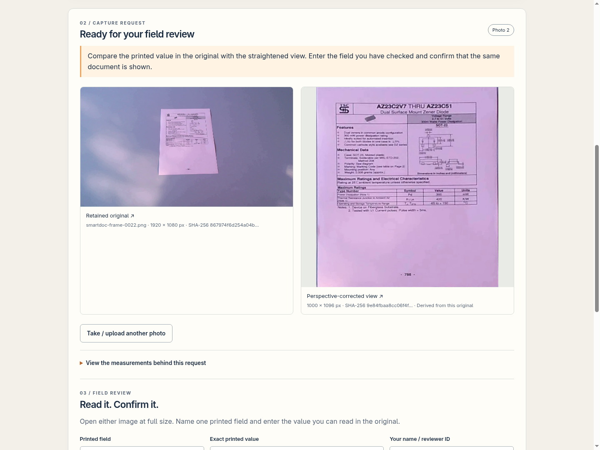

# Capture Loop · OpenCV 5

**Get a readable original before reviewing a printed value.** A photograph starts an evidence trail. Image measurements select a concrete capture request; a fresh photo continues the trail; the reviewer compares the retained original and a perspective-corrected view before recording a field.



This research branch adds a capture stage to DockProof. The production claim-review application continues its existing workflow. Execution here uses **OpenCV 5 and a rule-based controller**, with a local browser interface.

## Run the complete local workflow

From this branch of the DockProof repository:

```sh
uv run --no-project --with numpy==2.5.3 --with opencv-python-headless==5.0.0.93 \
  python experiments/capture-loop/serve.py --state temp/capture-loop
```

Open **http://127.0.0.1:18627/**. The server uses one local research case, stores its original files and review records in the chosen state directory, and uses two OpenCV CPU threads. JPEG and PNG uploads support images up to 8 MB / 24 megapixels.

1. Expand **Try recorded camera frames** and use **Frame 10**. The natural blur produces a request to steady the camera, focus on the printed text, and take a new complete photo.
2. Use **Frame 22**, a later natural view of the same sheet. The page boundary and focus measurements lead to field review.
3. Compare the full original and straightened view. For the sample, review `Power Dissipation` and `300 mW`, enter the reviewer role, and save the confirmation.
4. Export the session JSON. The state directory retains every original and derived image. New captures clear the active confirmation and preserve earlier reviews in the history.

Your own files use **Take / upload a photo**. The supported subject is one flat page or label with a visible boundary against a contrasting surface. The four-edge, focus and source-comparison steps form this experiment's review contract.

## What changed after natural-image testing

The original brightness-only probe selected the patterned background in all four selected natural frames, producing an incorrect edge request. The revised pipeline first searches for closed Canny quadrilaterals and measures Lab color contrast across each boundary. This selects the physical page on the textured background.

Strong blur can also erase the page outline. A whole-frame, fixed-width focus measurement handles that path and asks for focus recovery. A detected page receives perspective normalization and an interior focus measurement. The reviewer checks the needed printed value and intended document before confirmation.

| Selected natural observation | Measurement | Action | Recorded time |
| --- | --- | --- | --- |
| Frame 10 · natural blur | Whole-frame Laplacian variance 3.443 | Request sharper capture | 230.69 ms |
| Frame 22 · subsequent view | Four interior corners; normalized page focus 105.891 | Prepare field review | 122.88 ms |
| Frame 110 · natural blur | Whole-frame variance 12.574 | Request sharper capture | 54.71 ms |
| Frame 154 · natural blur | Whole-frame variance 5.405 | Request sharper capture | 49.99 ms |

The times are individual local observations; the first also includes initialization. Thresholds are **25** for the whole-frame fallback and **50** for the normalized page interior. Geometry development used frames 0 and 22, with frame 10 used for focus recovery; frames 110 and 154 are same-video checks. Frame selection covers this single printed sheet, camera recording, lighting and background. Shipping-label checks use the separately generated synthetic cases.

[evaluation.json](evaluation.json) contains the baseline failures, all four natural-frame measurements and three synthetic-label outcomes. [The recorded loop](evidence/recorded-loop.json) preserves the actual capture lineage, hashes and scripted `300 mW` confirmation. [Browser acceptance](evidence/browser-acceptance.json) covers upload → request → new photo → review, reload, stale-capture rejection, original bytes, current-review reset and 390 px layout. The uploader and reviewer in that run are explicitly scripted.

## Reproduce the selected checks

```sh
uv run --no-project --with numpy==2.5.3 --with opencv-python-headless==5.0.0.93 \
  python experiments/capture-loop/evaluate.py --output temp/capture-evaluation
```

The earlier three-case synthetic probe remains available as `probe.py`, with its original recorded run in `probe-result.json`. The new evaluation reports natural and synthetic observations separately.

## Source and license

Code and the original synthetic shipping label: repository MIT license. Natural SmartDoc camera frames: **CC BY 4.0**, with [full author attribution, source and transformation notes](fixtures/ATTRIBUTION.md). The screenshot above includes that attributed dataset. OpenCV: Apache-2.0; the Python wheel includes its third-party license files.

The next candidate stage is a tool-using capture agent and cloud execution. This local implementation exposes the image measurements, action trace and review boundary for that integration.
