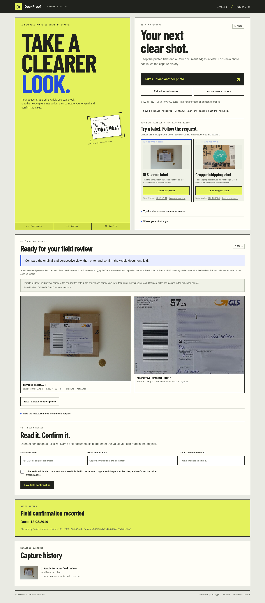

# Capture Loop · OpenCV 5 + a tool-using capture agent

**Get a readable original before reviewing a document field.** A photograph starts an evidence trail. Image measurements select a concrete capture request; a fresh photo continues the trail; the reviewer compares the retained original and a perspective-corrected view before recording a field.

**[Open the live capture station →](https://blucca.github.io/research/capture-loop/)** · Free field trial through **October 14, 2026, 12:00 UTC**. Each browser gets its own session and six capture attempts. Try the two supplied parcel photos, or upload a photo cleared for the trial. Session files expire after 24 hours and can be deleted from the page.



This research branch adds a capture stage to DockProof. The production claim-review application continues its existing workflow. The workstation supports the original **OpenCV 5 rule baseline** and a **live native-tool-calling model**, with optional AWS Lambda image measurement.

## Independent parcel photographs

[Four licensed shipping-label examples](domain/README.md) now extend the SmartDoc checks. A real GLS parcel exposed a five-corner paper-edge failure; a bounded convex-hull candidate recovers the label and leads to a readable-date review. The original failure, integrated local results, attribution and a reproducible check are public. The GLS case is a repair-development example; the remaining photos cover cropped, masked and blank-label controls. The private AWS Lambda now runs that same repair. The visible **Load GLS parcel** and **Load cropped label** buttons send the bundled source photos through the configured measurement and controller path.

## Recorded parcel workflow · AWS + live model tools

On **2026-10-11 (UTC+08)**, the rebuilt Lambda processed both visible parcel samples from real browser clicks:

| Independent source photo | AWS OpenCV observation | Executed next step |
| --- | --- | --- |
| GLS parcel | Four interior corners; normalized-page focus **340.928**; frame clearance **307 px** | `prepare_field_review`; a separate scripted browser review saved **Date: 12.08.2010** |
| Cropped shipping label | Document outline missing; whole-frame focus **528.019** | `request_recapture`; include the entire document and all four corners |

The run contains **four successful native model requests** and **two AWS image invocations**. The GLS measurement took **650.15 ms**. Its form began empty with its confirmation box clear; the saved date survived reload. Selecting the second, independent parcel retained the earlier original and review while clearing the active confirmation. Both 1440 px and 390 px layouts had zero horizontal overflow, with zero page errors in the GLS browser run.

[Complete native-tool session](evidence/parcel-cloud-loop.json) · [Deployment and browser record](evidence/parcel-acceptance.json) · [Mobile comparison](evidence/parcel-gls-mobile.png) · [GLS original](domain/images/small-parcel.jpg) · [Rectified view](domain/views/small-parcel-rectified.jpg).

These are selected development examples. The GLS source was used to repair the contour failure; the browser uploads and review were scripted. The two photos show separate parcels. The SmartDoc sequence below exercises a later capture of the same document.

## Capture station interface


The station uses a warehouse-signage direction: condensed lettering, signal yellow, cobalt annotations, square controls, and a label-framing diagram. The mobile layout gives the photograph action its own full-width control. Original identifiers remain in the exported record; image captions focus on the source and the next review action. The locally bundled Barlow Condensed font is SIL Open Font License 1.1; see [`web/fonts/OFL.txt`](web/fonts/OFL.txt).

The updated interface completed the recorded SmartDoc frame 10 → frame 22 → scripted `Power Dissipation: 300 mW` confirmation. The saved review survived reload, the 390 px and 320 px layouts had no horizontal overflow, and no page errors occurred. [Mobile view](evidence/station-mobile.png) · [Field comparison](evidence/station-review-mobile.png) · [Acceptance record](evidence/station-acceptance.json). This interface run uses the local rule controller; the earlier AWS/model execution is recorded separately below.

## The agent's actual job

The model calls `inspect_capture`, receives numerical OpenCV observations, and chooses a next-step tool. `request_recapture` saves a concrete request and waits for a new original. `prepare_field_review` opens the source-versus-perspective comparison and waits for a reviewer. Field entry and confirmation use the separate review form.

```text
New original → model calls inspect_capture → OpenCV 5 (local or AWS Lambda)
                                           ↓ geometry, focus, available view
               model chooses request_recapture or prepare_field_review
                                           ↓
                          saved next step + native tool trace
```

`capture.measure()` returns observations. `capture.rule_policy()` serves the baseline. The agent receives geometry, numeric measurements and the available view; its selected function is executed and persisted by the workstation. The next photo carries the earlier request into the next model turn. Every model request passes the repository's persistent credit-budget guard.

The [initial live-agent failure](evidence/agent-initial-failure.json) exposed a useful interface error: the model read the old `frameMarginPx` tolerance as measured clearance and asked for another framing change on frame 22. The tool now distinguishes `frameContactTolerancePx` from `minObservedFrameGapPx`, and describes page area as composition context. The intake contract uses page geometry and focus to open the separate field-legibility review.

### Recorded AWS + model run

| New original | Actual cloud observation | Model-selected and executed tool |
| --- | --- | --- |
| SmartDoc frame 10 | Whole-frame focus **3.443**; outline missing | `request_recapture` → wait for a sharper original |
| Subsequent frame 22 | Four interior corners; focus **105.891**; measured edge clearance **193.2 px** | `prepare_field_review` → wait for the reviewer |

The [complete recorded session](evidence/agent-loop.json) contains **four successful native model requests**, the two AWS Lambda request IDs and each tool result. Both image measurements ran in **AWS Lambda, Python 3.13.15, x86_64, OpenCV 5.0.0**. A separate scripted reviewer then recorded `Power Dissipation: 300 mW`; model actions and that scripted confirmation have separate records. [Acceptance](evidence/agent-acceptance.json) and the [390 px interface check](evidence/agent-browser.json) describe the performed checks. These observations use two selected frames from the existing SmartDoc recording; the uploads and reviewer were scripted.

## Run the complete local workflow

From this branch of the DockProof repository:

```sh
uv run --no-project --with numpy==2.5.3 --with opencv-python-headless==5.0.0.93 \
  python experiments/capture-loop/serve.py --state temp/capture-loop
```

Open **http://127.0.0.1:18627/**. The server uses one local research case, stores its original files and review records in the chosen state directory, and uses two OpenCV CPU threads. JPEG and PNG uploads support images up to 8 MB / 24 megapixels.

1. Choose **Load GLS parcel** in the visible sample cards. The source photo is uploaded through the same `/api/capture` endpoint as your own files; the configured OpenCV/controller path chooses its next action.
2. At field review, compare the handwritten date in the retained original and perspective view. Enter the field, the value you read and your reviewer ID, then select the comparison checkbox and save. The form starts empty.
3. Choose **Load cropped label** to see the separate framing example: its shipping label runs beyond the right edge. A fresh photo should step back, center the label and include all four edges. These two Commons photos show different packages.
4. For a same-document recovery sequence, expand **Try the blur → clear camera sequence** and use **Frame 10**, then **Frame 22**. The natural blur leads to a sharper-capture request; the later view of that sheet opens field review. Its example field is `Power Dissipation`, with visible value `300 mW`.
5. Export the session JSON. The state directory retains every original and derived image, with each new capture linked to its predecessor. New captures clear the active confirmation and preserve earlier reviews in the history.

The two parcel cards link directly to each Commons source page and its **CC BY-SA 3.0** license, naming photographer **Klaus Mueller**. They use the already bundled official 1280-pixel thumbnails from [`domain/manifest.json`](domain/manifest.json); the perspective images retain the same license. GLS recipient fields are masked in the published source. The active sample guide carries the source links alongside the image comparison.

Your own files use **Take / upload a photo**. The supported subject is one flat page or label with a visible boundary against a contrasting surface. The four-edge, focus and source-comparison steps form this experiment's review contract.

## Host an isolated field trial

The same workstation supports a same-origin HTTPS trial. Hosted mode assigns an opaque, HTTP-only session cookie; captures, images, reviews and exports belong to that browser's workspace. The default local mode retains its single-case workflow.

```sh
# Configure the model and AWS environment described below, then expose this
# loopback service through your HTTPS reverse proxy or development tunnel.
python experiments/capture-loop/serve.py \
  --state temp/capture-trial --controller agent --hosted \
  --public-origin https://capture.example.com \
  --expires-at 2026-10-14T12:00:00Z \
  --session-hours 24 --max-session-captures 6 --max-total-captures 40
```

Use a private state directory on a shared host. Photo attempts are reserved in a persistent ledger before processing, including failed attempts. One photograph runs at a time; the page remains available while it processes. Every live model request also passes the existing shared credit-budget guard. A dedicated AWS runtime identity can grant invocation of the one private image function; its creation and removal are documented in [`aws/README.md`](aws/README.md).

`GET /api/health` reports the trial's availability. `POST /api/reset` deletes that session's images, provider-debug files and review records while preserving its capture-attempt count. Session cleanup runs every minute and on requests. The trial expiry stops new captures; saved reviews and exports remain accessible through each session's own expiry. The page shows the storage period, expiry and remaining attempts. Feedback uses an explicit email link.

The focused hosted checks are in [`tests/test_hosted.py`](tests/test_hosted.py). They exercise separate browsers, image access, capture replacement, reset, persistence and expiry using the rule controller. Actual live AWS/model browser results are recorded separately.

### Public-browser run · October 11

The HTTPS station completed GLS → scripted date confirmation → reload → independent cropped label. The first flow took **13.07 s**, the second **9.74 s**, across four successful model requests and two AWS image invocations. Another browser started with an empty workspace; its request for the first browser's image returned HTTP 404. Reset removed saved originals and review records while retaining the attempt count. [Browser result](evidence/hosted-acceptance.json) · [Native-tool session](evidence/hosted-cloud-loop.json).

A separate GLS rendering check loaded every image successfully, including the retained original and perspective view, at desktop and 390 px widths. The screenshots show that fresh, awaiting-reviewer capture. [Image-render result](evidence/hosted-render-check.json) · [Desktop](evidence/hosted-desktop.png) · [Mobile](evidence/hosted-mobile.png). These three captures are internal scripted checks; field-trial feedback is collected separately.

## Enable live agent decisions

Use **Node 26+**, the Python dependencies above, and a configured Nebius account. Set `NEBIUS_API_KEY`, `NEBIUS_MODEL` (`nvidia/nemotron-3-super-120b-a12b`) and `NEBIUS_BUDGET_FILE`. Create that private budget from the repository's `budget.example.json`, entering the actual confirmed credits, approved ceiling, model prices and expiry. Its initial zero-credit configuration pauses live requests until configured.

```sh
# Environment variables contain your own private provider and budget settings.
uv run --no-project --with numpy==2.5.3 --with opencv-python-headless==5.0.0.93 \
  python experiments/capture-loop/serve.py --state temp/capture-agent --controller agent
```

Use the same frame 10 → new frame 22 workflow. The interface shows the executed tool and its measurement-based explanation. The JSON export includes the native assistant tool calls, corresponding observation/action results and pending review state. Up to four model turns are available per photograph; provider failures pause that capture. For a standalone photograph, run `node experiments/capture-loop/agent.mjs --source IMAGE --output temp/capture-agent` with `CAPTURE_PYTHON` pointing to the Python environment containing OpenCV.

### Run the image tool on AWS

The [AWS package and deployment instructions](aws/README.md) provide a private synchronous Lambda measurement function. Set `CAPTURE_MEASURE_FUNCTION` to the deployed function name, `CAPTURE_AWS_CLI` to your AWS CLI executable or executable wrapper, and the normal AWS profile/region environment. Start the same workstation with `--controller agent`.

Here the model's `inspect_capture` call uploads the original to the configured Lambda function, executes OpenCV there, and returns measurements and the perspective image to the workstation. The model receives the numerical result; originals, derived views and reviewer confirmations remain in the workstation's evidence record. The cloud path accepts the image size supported by the synchronous Lambda payload; its connector reports the applicable limit before upload.

## What changed after natural-image testing

The original brightness-only probe selected the patterned background in all four selected natural frames, producing an incorrect edge request. The revised pipeline first searches for closed Canny quadrilaterals and measures Lab color contrast across each boundary. This selects the physical page on the textured background.

Strong blur can also erase the page outline. A whole-frame, fixed-width focus measurement handles that path and asks for focus recovery. A detected page receives perspective normalization and an interior focus measurement. The reviewer checks the needed visible value and intended document before confirmation.

| Selected natural observation | Measurement | Action | Recorded time |
| --- | --- | --- | --- |
| Frame 10 · natural blur | Whole-frame Laplacian variance 3.443 | Request sharper capture | 230.69 ms |
| Frame 22 · subsequent view | Four interior corners; normalized page focus 105.891 | Prepare field review | 122.88 ms |
| Frame 110 · natural blur | Whole-frame variance 12.574 | Request sharper capture | 54.71 ms |
| Frame 154 · natural blur | Whole-frame variance 5.405 | Request sharper capture | 49.99 ms |

The times are individual local observations; the first also includes initialization. Thresholds are **25** for the whole-frame fallback and **50** for the normalized page interior. Geometry development used frames 0 and 22, with frame 10 used for focus recovery; frames 110 and 154 are same-video checks. Frame selection covers this single printed sheet, camera recording, lighting and background. The original synthetic shipping-label checks remain in that report; the independent parcel photographs have their own domain and cloud records above.

[evaluation.json](evaluation.json) contains the baseline failures, all four natural-frame measurements and three synthetic-label outcomes. [The recorded loop](evidence/recorded-loop.json) preserves the actual capture lineage, hashes and scripted `300 mW` confirmation. [Browser acceptance](evidence/browser-acceptance.json) covers upload → request → new photo → review, reload, stale-capture rejection, original bytes, current-review reset and 390 px layout. The uploader and reviewer in that run are explicitly scripted.

## Reproduce the selected checks

```sh
uv run --no-project --with numpy==2.5.3 --with opencv-python-headless==5.0.0.93 \
  python experiments/capture-loop/evaluate.py --output temp/capture-evaluation
```

The earlier three-case synthetic probe remains available as `probe.py`, with its original recorded run in `probe-result.json`. The new evaluation reports natural and synthetic observations separately.

## Source and license

Code and the original synthetic shipping label: repository MIT license. Natural SmartDoc camera frames: **CC BY 4.0**, with [full author attribution, source and transformation notes](fixtures/ATTRIBUTION.md). The earlier SmartDoc screenshots include that attributed dataset. Parcel photos and their perspective views use the source-specific CC BY-SA licenses in [domain attribution](domain/ATTRIBUTION.md). The `parcel-gls-*.png` and `hosted-*.png` screenshots are CC BY-SA 3.0 and include the GLS and cropped-label photographs by Klaus Mueller. OpenCV: Apache-2.0; the Python wheel includes its third-party license files.

The next evaluation scope is fresh shipping-label photography from external users, covering their phones, lighting, print sizes and backgrounds. Current image observations cover the selected SmartDoc recording and the four Commons examples. Live agent/AWS execution, scripted field confirmations and external use are recorded separately.
